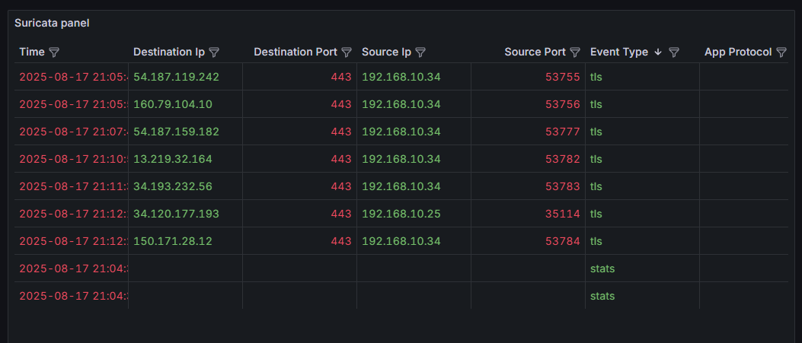

# 🔐 HardPoint-It-lab

**Perimeter-Lab** — a hands-on network security lab with **Suricata IPS/IDS**, **Grafana dashboards**, **DNS-over-HTTPS on OpenWrt**, and **RouterOS routing**.  
All client traffic is inspected through Suricata in inline mode, while DNS queries are encrypted with DoH.  
The repository includes configs, dashboards, and setup examples for learning and practice.

---

## 📊 Grafana Dashboard

Example view of Suricata alerts in Grafana:  



---

## ⚙️ Components
## 🔎 Optional Components
- **Elasticsearch + Filebeat** – log storage and search for Suricata `eve.json`  
- **Kibana or Grafana-Loki** – advanced visualization of alerts  
- **Suricata** – IPS/IDS in inline mode with `eve.json` logs  
- **Grafana** – dashboards for alerts, TLS traffic, and statistics  
- **OpenWrt + DoH** – secure DNS using `https-dns-proxy`  
- **RouterOS** – routing and NAT with configs provided  

---

## 🚀 Quick Start

### RouterOS Config
```rsc
/interface ethernet
set [ find default-name=ether1 ] name=LAN
set [ find default-name=ether2 ] name=WAN

/interface wireless security-profiles
set [ find default=yes ] supplicant-identity=MikroTik

/ip address
add address=192.168.1.2/24 interface=LAN network=192.168.1.0
add address=192.168.1.3/24 interface=WAN network=192.168.1.0

/ip dhcp-client
add disabled=no interface=WAN

/ip firewall nat
add action=masquerade chain=srcnat out-interface=WAN

/ip route
add distance=1 gateway=192.168.1.1


## 🚨 OpenWrt DoH Setup


Install proxy:

opkg install https-dns-proxy luci-app-https-dns-proxy


Configure Cloudflare DoH:

uci set https-dns-proxy.@https-dns-proxy[0].resolver='cloudflare'
uci set https-dns-proxy.@https-dns-proxy[0].bootstrap_dns='1.1.1.1,1.0.0.1'
uci commit https-dns-proxy
/etc/init.d/https-dns-proxy restart


Adjust dnsmasq:

uci set dhcp.@dnsmasq[0].noresolv='1'
uci add_list dhcp.@dnsmasq[0].server='127.0.0.1#5053'
uci commit dhcp
/etc/init.d/dnsmasq restart


Test with:

nslookup google.com


